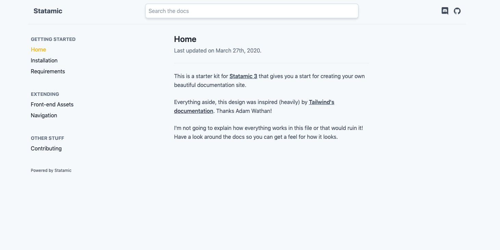

# Statamic Starter Kit: Docs

This repository contains a Statamic Starter Kit for creating a documentation website. You're welcome to clone it down and start playing with it. You can view [a demo over here](https://statamic-docs-starter-kit.netlify.app/).

While this starter kit itself is free and doesn't require a license, you can [optionally donate to Duncan](https://duncanmcclean.com/donate), the developer behind it to show your appreciation.

## Features
* Beautiful documentation
* Built with Tailwind with Vanilla JS
* Responsive
* Compatible with Statamic's Static Site Generator
* Inspired by the Tailwind CSS docs, thanks Adam Wathan 😃
* Integrated with the raddest CMS

## Quick Start
You can read the [install instructions](https://statamic-docs-starter-kit.netlify.app/installation) on the docs.

## Contributing
You can also read the [contribution information](https://statamic-docs-starter-kit.netlify.app/contributing/) on the docs.
